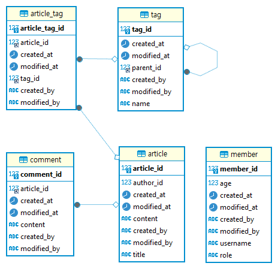

# Spring을 이용한 게시판 구현(v 0.1)
### 1. 요구사항
- 게시글 
  - 목록 표시
  - 작성 기능
  - 수정 기능
  - 삭제 기능
  - 검색 기능
- 댓글
  - 목록 표시
  - 작성 기능
  - 수정 기능
  - 삭제 기능
  - 검색 기능

### 2. Table

- Member : 회원 정보
- Article : 게시글 정보
- Comment : 댓글 정보
- Tag : 게시글 검색 태그


### 3. Rest API
- GET/articles : 게시글 목록
- POST/articles : 게시글 작성
- GET/articles/{id} : 게시글 상세
- PUT/articles/{id} : 게시글 수정
- GET/search/articles : 게시글 검색
- POST/articles/{id}/comments : 댓글 작성
- PUT/comments/{id} : 댓글 수정
- DELETE/comments/{id} : 댓글 삭제
- GET/search/comments : 댓글 검색

### 4. Tips(JPA)
 [1] 공통 엔티티 적용
  - 추상 (공통)엔티티 구현 예

```java
import jakarta.persistence.Entity;
import jakarta.persistence.EntityListeners;
import jakarta.persistence.MappedSuperclass;
import practice.post.domain.BaseEntity;

@MappedSuperclass
@EntityListeners(AuditingEntityListener.class)
public abstract class BaseEntity {
  @CreatedBy
  private String createdBy;
  @CreatedDate
  private LocalDateTime createdAt;
  @LastModifiedBy
  private String modifiedBy;
  @LastModifiedDate
  private LocalDateTime modifiedAt;
}
```
  - Main함수에 @EnableJpaAuditing 적용.
  - 적용하고자 하는 클래스에서 상속.

 [2] Paging
   - JPA에서 제공하는 페이징 메서드로 구현 예
```java
  List<Member> memberList = em.createQuery("select m from Member m order by id desc", Member.class)
          .setFirstResult(0)
          .setMaxResults(10)
          .getResultList();
```
   - 쿼리의 'order by'로 적용함에 주의.
